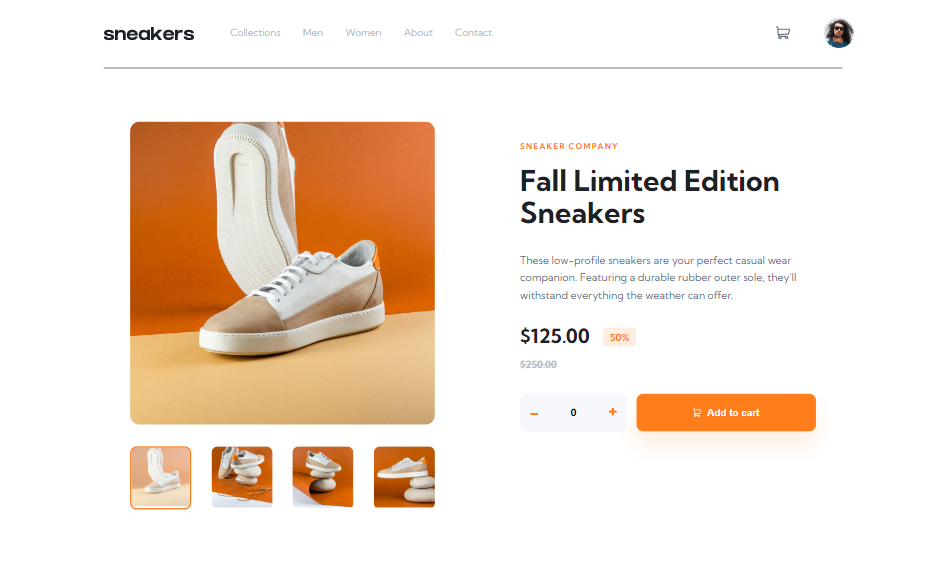

# Frontend Mentor - E-commerce product page solution

This is a solution to the [E-commerce product page challenge on Frontend Mentor](https://www.frontendmentor.io/challenges/ecommerce-product-page-UPsZ9MJp6). Frontend Mentor challenges help you improve your coding skills by building realistic projects.

## Table of contents

- [Overview](#overview)
  - [The challenge](#the-challenge)
  - [Screenshot](#screenshot)
  - [Links](#links)
- [My process](#my-process)
  - [Built with](#built-with)
  - [What I learned](#what-i-learned)
- [Author](#author)

## Overview

### The challenge

Users should be able to:

- View the optimal layout for the site depending on their device's screen size
- See hover states for all interactive elements on the page
- Open a lightbox gallery by clicking on the large product image
- Switch the large product image by clicking on the small thumbnail images
- Add items to the cart
- View the cart and remove items from it

### Screenshot

### Links

- Solution URL: [https://github.com/NischalJoshi19/Projects/tree/main/ecommerce-product-page-main](https://github.com/NischalJoshi19/Projects/tree/main/ecommerce-product-page-main)
- Live Site URL: (https://your-live-site-url.com)

## My process

### Built with

- Semantic HTML5 markup
- CSS custom properties
- Flexbox
- Mobile-first workflow
- Vanilla Javascript

### What I learned
I got to learn a lot while working on the project. The placement of the menu, the lightbox display, the cart - I started working on the project thinking I don't know how to do this. This project involves a lot of CSS trickery and JS. So many different features to implement first overwhelmed me. However, as I started, things started getting sorted out. It has been a really good project to practice my layout, positioning and js skills.

## Author

- Frontend Mentor - [@NischalJoshi19](https://www.frontendmentor.io/profile/NischalJoshi19)
